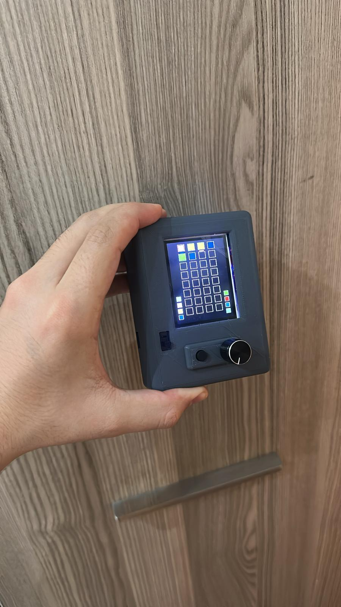
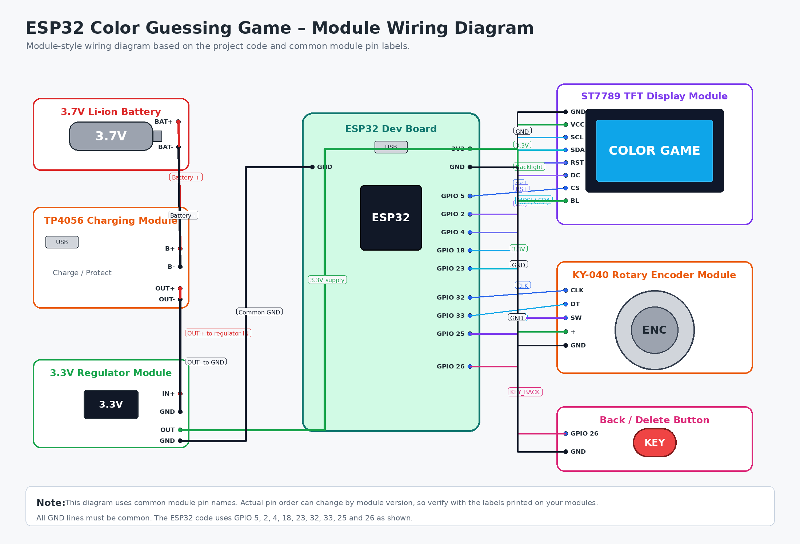
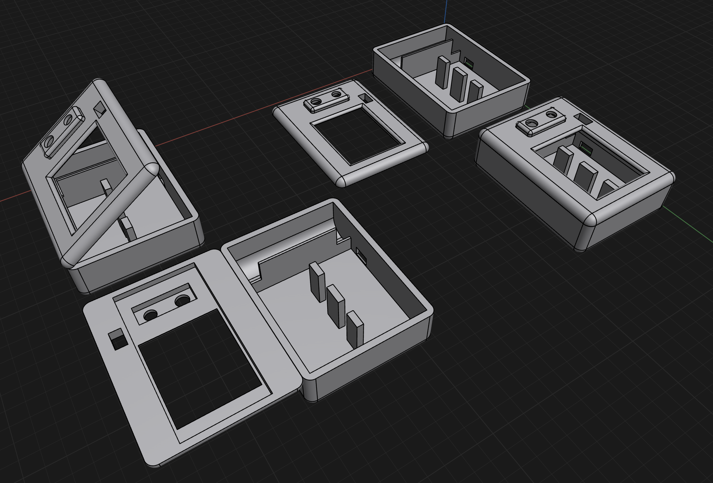
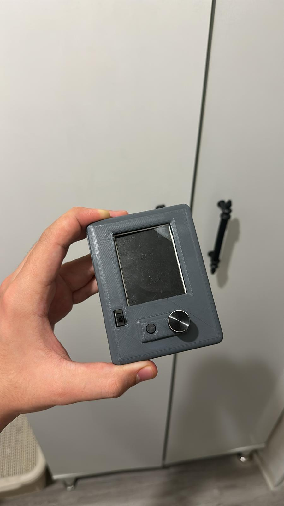
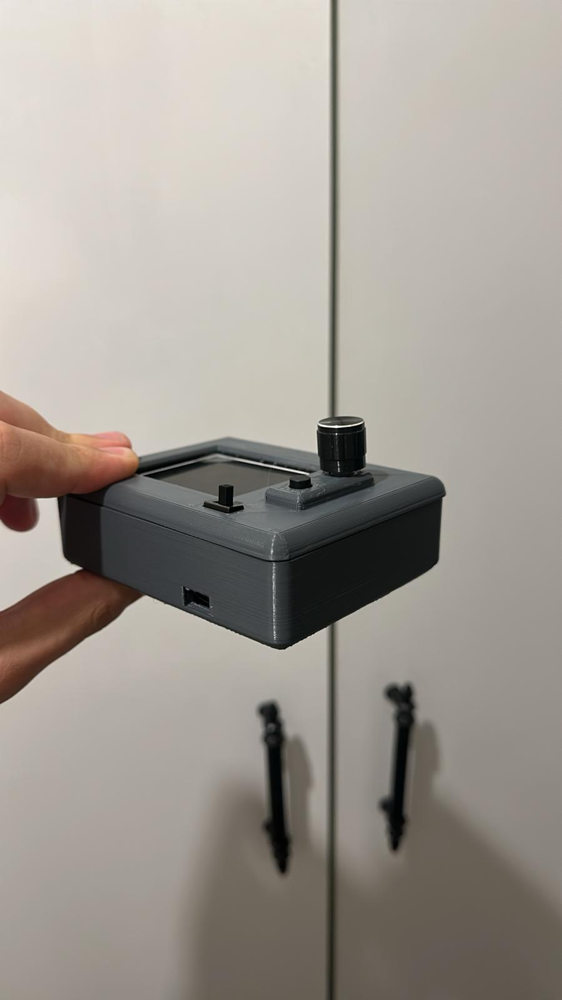

# ESP32 Color Guessing Game

[🇹🇷 Türkçe README](README_TR.md)

ESP32 Color Guessing Game is an embedded game project developed using an ESP32 microcontroller, an ST7789 TFT display, a rotary encoder, and a custom 3D printed enclosure.

The game is inspired by code-breaking logic games. The player tries to guess a hidden 4-color code selected from an 8-color palette. Each guess is displayed on the TFT screen, and the system provides visual feedback for correct colors and correct positions.

## Working Prototype



## Features

- ESP32 based embedded game system
- ST7789 240x320 TFT display interface
- Rotary encoder based user input
- 8-color selectable palette
- 4-slot hidden color code
- Maximum 8 attempts
- Guess history displayed on screen
- Visual feedback system
- State machine based game flow
- Custom 3D printed enclosure
- Portable Li-ion battery powered design

## Hardware Used

- ESP32 development board
- ST7789 240x320 TFT display module
- Rotary encoder with push button
- Push button for back/delete function
- 3.7V Li-ion battery
- Li-ion battery charging module
- 3.3V voltage regulator
- Jumper wires
- Custom 3D printed case

## Power Supply

The project is powered by a 3.7V Li-ion battery.

A charging module is used for battery charging, and a voltage regulator is used to provide a stable 3.3V supply for the ESP32 and the circuit.

### Power Components

- 3.7V Li-ion battery
- Li-ion battery charging module
- 3.3V voltage regulator

> Note: Power wiring may vary depending on the ESP32 development board, charging module, and regulator used.

## Pin Connections

| Component | ESP32 Pin |
|---|---|
| TFT CS | GPIO 5 |
| TFT DC | GPIO 2 |
| TFT RST | GPIO 4 |
| TFT SCK / SCL | GPIO 18 |
| TFT MOSI / SDA | GPIO 23 |
| Encoder A / CLK | GPIO 32 |
| Encoder B / DT | GPIO 33 |
| Encoder Push / SW | GPIO 25 |
| Back Button | GPIO 26 |

> Note: ST7789 display module pin names may vary depending on the module version. Some modules label SPI pins as SCL/SDA, while others use SCK/MOSI.

## Wiring Diagram



## Game Logic

The system generates a random 4-color secret code at the beginning of each game.

The player selects colors using the rotary encoder and confirms each selection by pressing the encoder button.

After each 4-color guess, the system compares the guess with the secret code and provides visual feedback:

- Green: Correct color and correct position
- Yellow: Correct color but wrong position
- White / Empty: No match

The player wins if all 4 colors are guessed in the correct positions within 8 attempts. If the player cannot find the correct code within 8 attempts, the secret code is shown on the screen.

## 3D Printed Enclosure

A custom enclosure was designed and printed for this project.

The enclosure was created to hold the ESP32, ST7789 TFT display, rotary encoder, back/delete button, power switch, battery, charging module, and voltage regulator in a compact prototype form.

### 3D Model Overview



### Enclosure Front View



### Enclosure Side View



## 3D Model Files

The enclosure consists of two main parts:

- `case` – main body of the enclosure
- `cover` – front cover / top panel

Both STL and STEP files are provided.

### Case

- STL: `3d-models/case/stl-files/case.stl`
- STEP: `3d-models/case/step-files/case.step`

### Cover

- STL: `3d-models/cover/stl-files/cover.stl`
- STEP: `3d-models/cover/step-files/cover.step`

STL files are provided for 3D printing.

STEP files are provided for CAD editing and modification.

## Technologies Used

- ESP32
- Arduino IDE
- C/C++
- Adafruit GFX Library
- Adafruit ST7789 Library
- SPI Communication
- Rotary Encoder Input
- Embedded UI Design
- 3D Modeling
- 3D Printing

## Project Structure

```text
esp32-color-guessing-game
├── 3d-models
│   ├── case
│   │   ├── step-files
│   │   │   └── case.step
│   │   └── stl-files
│   │       └── case.stl
│   │
│   └── cover
│       ├── step-files
│       │   └── cover.step
│       └── stl-files
│           └── cover.stl
│
├── images
│   ├── 3d-model-overview.png
│   ├── enclosure-front-view.jpg
│   ├── enclosure-side-view.jpg
│   └── working-prototype.jpg
│
├── schematics
│   └── module-style-wiring-diagram.png
│
├── src
│   └── esp32-color-guessing-game
│       └── esp32-color-guessing-game.ino
│
├── LICENSE
└── README.md
